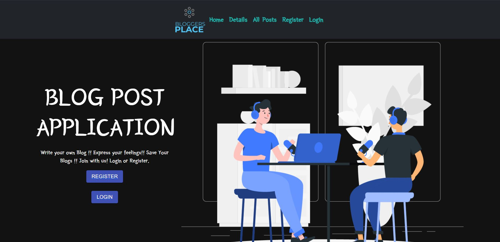
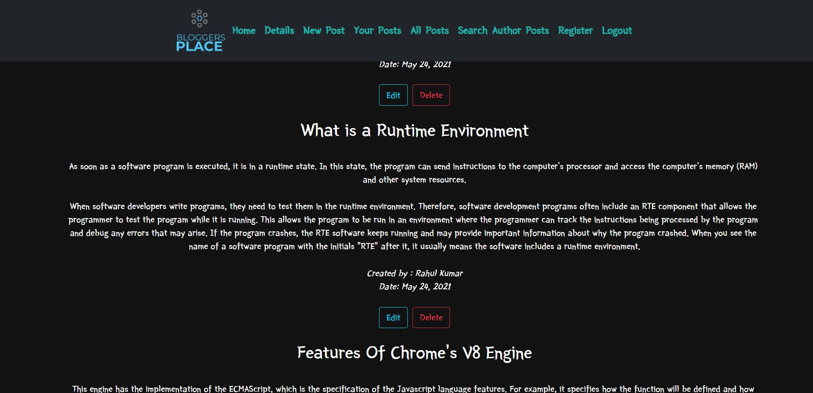
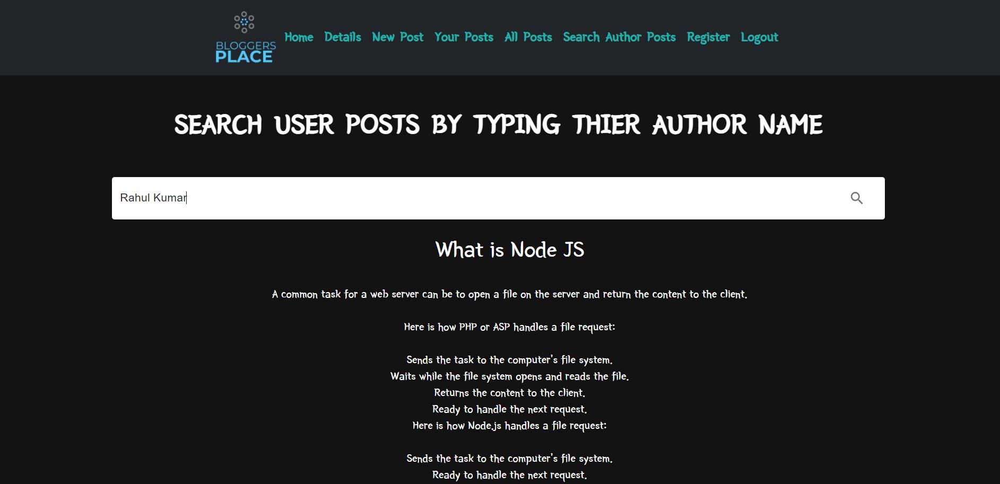
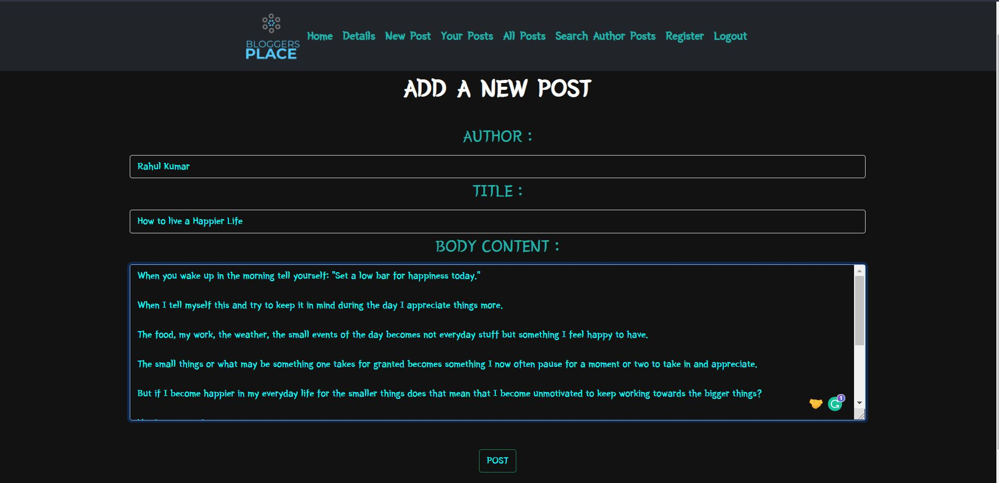

<br />
<p align="center">
  
  <h1 align="center">BLOGGERS ARENA</h3>

  <p align="center">
    This is a MERN Stack based fully Functioning Blogging Website.
   <br>
   Here Users can Login, Register make Authenticated Requests, Users can Read, Write, Update, Delete Blogs and also Search Blogs by Author Name.
    <br />
    
  </p>
</p>

<br>
  <p align="center">
  
</p>
<br>


### GETTING STARTED :-

- Clone this Repository using  `git clone <repo>`

- Do cd to the directories and type `npm install`.

- The do `cd Server`.

- Then run `npm run dev`. By Runing this Both the Frontend and Backend Server will be running Concurrently.

- Open [http://localhost:3000](http://localhost:3000) to view it in the browser.

The page will reload if you make edits.\
You will also see any lint errors in the console.


### FEATURES:-

- This is a Fully Functioning Blogging Website with `User Authentication` And `Authorization`.

- Here Users Can see `all the Posts` posted in this Website `without registering` themselves and `even without logging` in to the` Website`.

- In Order to write a `New Post`, the User has to `get registered themselves first` if they are using this platform for first time or directly `login` if they had `registered themselves previously`.

- After logging in the `User` can `Write a post, Update an Existing Post , Search posts by Author Name` ,`View its created posts`.

<!-- - While creating a `new post` `anonymous post` creations are `handled` by using the `bad-words package` of npm. Still it does not cover all the bad words but can `bypass` some of them. Its a `request` for all the `users` using this platform to `take care of the words` they use while `creating a post`. -->

- `Once` a `User logs in` you are good to go and Whenever the user `next time visits this website` the user is `not reqiuired to log in Again`.

- This Application is using `MongoDB Atlas's` free Cloud Service as the `Database Service`.


### TECHNOLOGIES USED:-
```
Frontend:- React.js, React Hooks, React-Bootstrap, Axios
```
```
Backend:- Node.js, Express.js, JsonWebToken
```
```
Database:- MongoDB
```

### SCREENSHOTS:- 

<br>
  <p align="center">
  
</p>
<br>


<br>
  <p align="center">
  
</p>
<br>


<br>
  <p align="center">
  
</p>
<br>


### 🤝 HOW TO CONTRIBUTE?

- Take a look at the Existing Issues or create your own Issues!

- Wait for the Issue to be assigned to you after which you can start working on it.

- Fork the Repo and create a Branch for any Issue that you are working upon.

- Create a Pull Request which will be promptly reviewed and suggestions would be added to improve it.

- Add Screenshots to help us know what this Script is all about.


